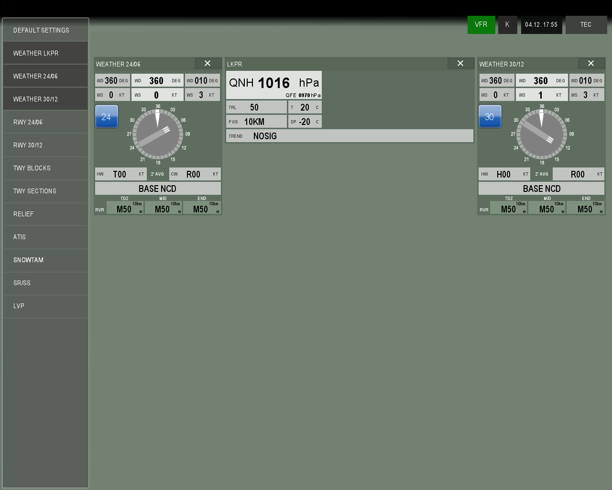

<b>Meteo system AMS.3 based on real-life LKPR equipment</b>

- Instrument for Air Manager platform for personal entertainment non commercial use
- Can display weather from FSX/P3D (for TowerView when controlling on VATSIM/IVAO) 
- You must install custom panel with custom gauge and LUA script into FSX. Open Resources folder for those files! 
- Optimised for 17" 1280x1024 screens like the real unit :-) 
- To install from GitHub: Click Code -> Download as ZIP. Download will begin for ZIP folder eg. xxxyyy.zip. When download is finished, open the ZIP and you will find a sub-folder inside with similar name. This subfolder should include files <i>logic.lua</i>, folder <i>resources</i> and maybe other files. Go to your C:\Users\username\Air Manager\instruments\OPEN_DIRECTORY and create folder with name <b>5ff21df2-44e0-4e91-38a6-c50843f180d7</b> (that is your Air Manager hash for this instrument). Copy all the files which you just downloaded (<i>logic.lua</i>, folder <i>resources</i>, etc) directly into this hash folder. Then run your Air Manager, which should immediately discover this new instrument

